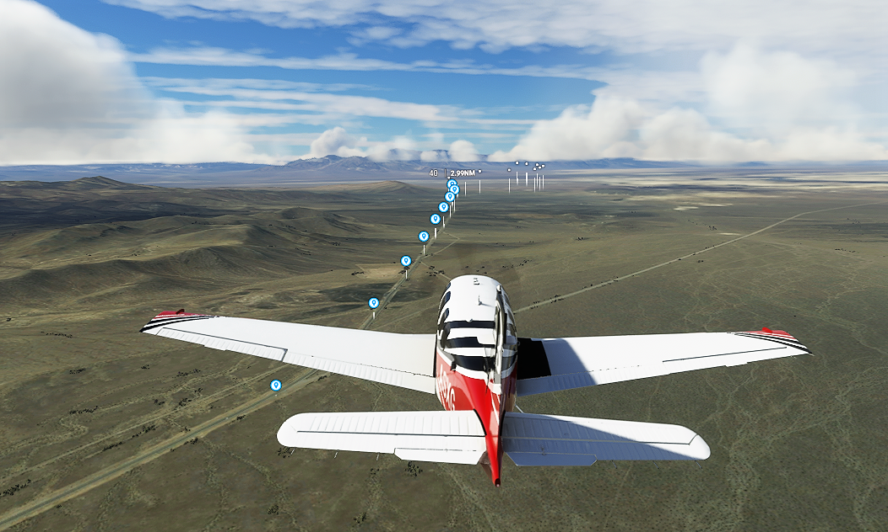
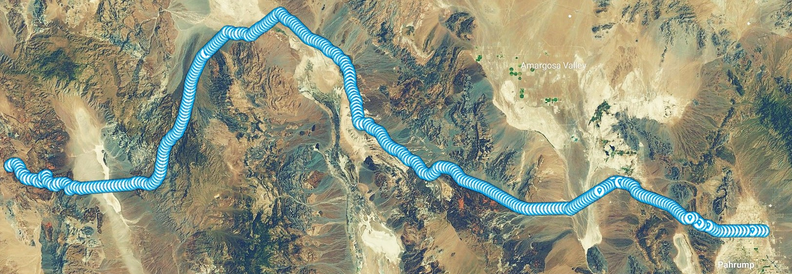

# gpx2msfs
A script to read [GPX](https://en.wikipedia.org/wiki/GPS_Exchange_Format) files and output a [MSFS2020](https://en.wikipedia.org/wiki/Microsoft_Flight_Simulator_(2020_video_game)) project structure ready to compile. 
The result shows POI of your gpx tracks or waypoints during flight.


```help
usage: 
gpx2msfs.py [-h] 
            [-s SCENERYNAME]                            a name for your scenery 
            [-o OUTPUTPATH]                             where to place all files
            [-c CREATOR]                                your name (can be ommited)
            [-m MANUFACTURER]                           your company name (can be ommited)
            [-z OFFSET]
            [--mindistance MINDISTANCE] 
            [--cleanup]                                 remove all files from output folder 
            [-v {DEBUG,INFO,WARNING,ERROR,CRITICAL}]
            [inputfile]                                 name of gpx file or search pattern, 
                                                        i.e. *.gpx
                                                        
gpx2msfs -s myjourney [my_last_journey.gpx]             produce a msfs project named myjourney 
```


## Manual Installation

**gpx2msfs.py** is a Python program, it requires an installed [Python](https://en.wikipedia.org/wiki/Python_%28programming_language%29) environment and some additional librarys.

##### Windows

Install [Python 3.x](https://www.python.org/downloads/windows/) as described


##### Linux
Python is usually installed by default on most linux distributions.
If not download and install it according to [Python 3.x](https://www.python.org/downloads/).

##### MacOS

Install [Python 3.x](https://www.python.org/downloads/mac-osx/) as described


#### Installation of required librarys
Go to the directory of your gpx2msfs installation and run
```shell
python -m pip install -r requirements.txt
```
This should install all required libs to your system.
Most important is the lib [GPXPy](https://github.com/tkrajina/gpxpy)

## Precompiled Package
For Windows there is a precompiled package under [Releases](https://github.com/dc6jn/gpx2msfs/releases).

If you are brave enough to run executables from the internet you are fine.
(Just kidding: this version was compiled from my source using [PyInstaller](https://pyinstaller.org/en/stable/index.html).


```bash
pyinstaller --onefile gpx2msfs.py
```
Keep in mind that this version might not contain the very last changes.)
## Usage


### Data Preparation
GPX files can contain a lot of datapoints, especially if aquired by using a gps logger.
It makes absolutely no sense to feed such data into this script because you would get
* a very huge msfs project file which takes very long to load
* inside the game a tremendous amount of POI markers
* most probably a very low frame rate
* clutter your screen

So keep in mind it is very important to keep the number of points at a reasonably (low) value.
In my experiments I found it sufficient that POI following a way can at least be separated by 1000m.

For a quick and dirty solution you can add the command line parameter
```bash
[--mindistance MINDISTANCE]
i.e.
--mindistance 1000  keep a waypoint every 1000m 
```
with MINDISTANCE as minimal distance of waypoints, all waypoints below this limit will be suppressed in output.
This Option uses the simplify function from the gpypx lib [Ramer-Douglas-Peucker algorithm](http://en.wikipedia.org/wiki/Ramer-Douglas-Peucker_algorithm)

To get more control over this process I recommend external solutions:
#### [GPSBabel](https://www.gpsbabel.org/)
The well known [GPSBabel](https://www.gpsbabel.org/) can be used for our purpose.

```bash
gpsbabel -i gpx -f way_iv.gpx  \
    -x simplify,crosstrack,error=0.001k \
    -o gpx -F merge.gpx
```
taken from https://wiki.openstreetmap.org/wiki/GPSBabel/Using_filters where you can find a lot of useful filter settings.

Experiment with the crosstrack value, smaller means more waypoints but better resolution, bigger less waypoints but more or less coarse track.

#### [RouteConverter](https://www.routeconverter.de/home/en)
Another amazing program for gpx handling is [RouteConverter](https://www.routeconverter.de/home/en).
This program is available for Windows, Linux and MacOS and lets you manipulate tracks, routes and waypoints.

#### [GPSPrune](https://activityworkshop.net/software/gpsprune/)
The tool [GPSPrune](https://activityworkshop.net/software/gpsprune/) is a java program to cleanup your files. In fact the files in the demo folder were prepared with this tool. 


> **Note**  
>There are a lot of suitable programs available, just find your favourite.
>
> Also keep in mind that you can convert other file formats like [KML](https://en.wikipedia.org/wiki/Keyhole_Markup_Language) into gpx.

### Project creation
If you finally have a suitable gpx dataset you can create the msfs project with

```bash
gpx2msfs.py -s demo -o myproject -c me -m mycompany demo\usa_100mcleaned.gpx
```
Shortly afterwards **you should**™ get a valid folder structure in **myproject**

Within this folder there should be a file demo.xml.
Now you can use either

```bash
fspackagetool [Path to myproject]/demo.xml
```
from MSFS SDK or the internal compiler reachable from the developer menu in msfs to compile the final scenery package usable in the game.

If everything worked good msfs should greet you with something like this:


Enjoy!


## todo's & bugs
I'm sure there will be bugs. If you find one let me know, or, even better, send a pull request.

Some ideas for future improvement are
* make my own POI signs with custom layout (direction arrows, nice symbols)
* add "billboards" with images from that location during my visit
* add ability to switch on/off only selected groups of tracks/waypoints